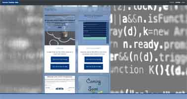
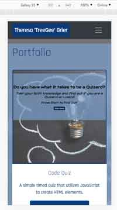

# Professional Materials

Now that I've had some practice with APIs and have a project to share, I'll be updating my portfolio page and other materials to build toward being employer-competitive.

## Updated Portfolio

Your updated portfolio should:
- [x] Display your full name, email, and phone number
- [x] Have links to your GitHub profile and LinkedIn profile
- [x] Have a link to a downloadable PDF of your resume
- [x] Display at least 2 examples of student work from either deployed projects or homeworks. For each project, make sure you have the following:
    - [x] Project title
    - [x] Link to the deployed version
    - [x] Link to the GitHub repository
    - [x] Screenshot of the deployed application
- [x] Have a polished, mobile-responsive user interface.

### Site Images

Main Page with Bio:

Portfolio Page:

* Mobile-first design

Main Page with Bio:

Portfolio Page:

## Updated GitHub Profile

[TreeGee73](https://github.com/TreeGee73)

## Technology

CSS Framework: [Bootstrap](https://getbootstrap.com/)
Bootstrap Depends on [JQuery](https://jquery.com/) and [JavaScript](https://www.javascript.com/) so these are also implimented on this site

## Link

This app can be accessed at [professional-materials](https://treegee73.github.io/professional-materials/)

## Credits
Background image is a free to use image that was obtained from [Pexels.com](https://www.pexels.com/).

## Contact
Contact me at [treegee73@gmail.com](mailto:treegee73@gmail.com)