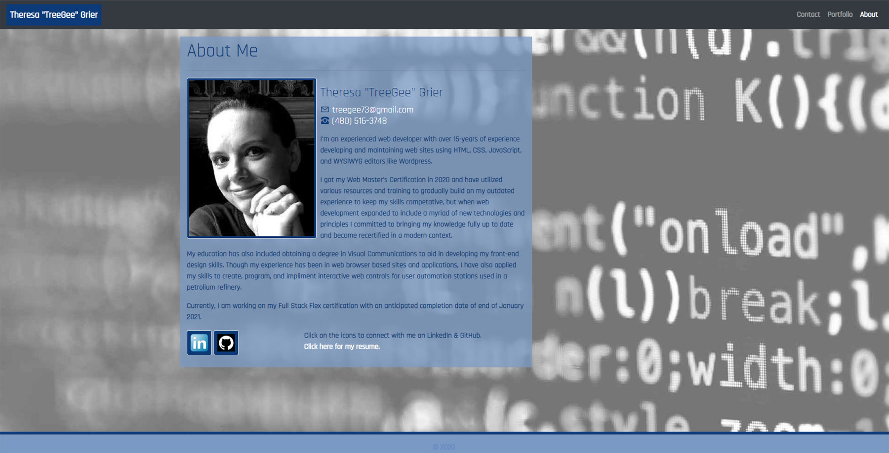

# Professional Materials

## Table of Contents
  * [Description](#description)
  * [Usage](#usage)
  * [Updated Porfolio](#updated-portfolio)
  * [Technology](#technology)
  * [Installation](#installation)
  * [Testing](#testing)
  * [License](#license)
  * [Credits](#credits)
  * [Images / Demo Video](#images-/-demo-video)
  * [Contributing to This Repo](#contributing-to-this-repo)
  * [Questions / Contact Details](#questions-/-contact-details)

---

  ## Description
This is an update to include additional materials on my portfolio page, including Project 2. Now that you've built a full-stack web application and have another project to share, you'll be updating your portfolio page and other materials to build toward being employer-competitive. <em><s>Now that I've had some practice with APIs and have a project to share, I'll be updating my portfolio page and other materials to build toward being employer-competitive.</s></em>

---

  ## Usage
Provide an updated portfolio to help potential employers evaluate my work and suitability for future opportunities.

---

  ## Updated Portfolio
Your updated portfolio should:
- [x] Display your full name, email, and phone number
- [x] Have links to your GitHub profile and LinkedIn profile
- [x] Have a link to a downloadable PDF of your resume
- [x] Display at least 2 examples of student work from either deployed projects or homeworks. For each project, make sure you have the following:
    - [x] Project title
    - [x] Link to the deployed version 
    - [x] Link to the GitHub repository
    - [x] Screenshot of the deployed application
- [x] Have a polished, mobile-responsive user interface.

---

  ## Technology
My porfolio site utilizes the following technologies:
 - CSS Framework: [Bootstrap](https://getbootstrap.com/)
 - Bootstrap Depends on [JQuery](https://jquery.com/) and [JavaScript](https://www.javascript.com/) so these are also implimented on this site.

The applications included in my portfolio utilize some or all of the following in addition to those listed above:
 - [Foundation](https://get.foundation/) CSS
 - [npm](https://www.npmjs.com/)
 - [NodeJS](https://nodejs.org/)
 - [Jest](https://jestjs.io/)
 - [MySQL](https://www.mysql.com/)
 - [Express Handlebars](https://www.npmjs.com/package/express-handlebars)
 - [Heroku](https://www.heroku.com/)

---

  ## Installation
Some applications utilize NodeJS, Jest (for Testing), and other npm packages. Simply use npm i to install.

---

  ## Testing
As noted above, some applications utilize NodeJS, Jest (for Testing), and other npm packages. Simply use npm test to run tests.

---

  ## License
The applications are covered under a MIT license.

---

  ## Credits
Background image is a free to use image that was obtained from [Pexels.com](https://www.pexels.com/).

---

  ## Images / Demo Video
  A video demonstration of this application can be found [here](https://youtu.be/8QQGD-kPY20).
  Click the image to launch the video.

  

---

  ## Contributing to This Repo
  Please Contact me.

---

  ## Questions / Contact Details
  This app can be found on my Github page at [TreeGee73](https://github.com/TreeGee73).

  If you have any questions or need to contact me about this app, I can reached either on Github or by email at [treegee73@gmail.com](treegee73@gmail.com).
